# NIFTY50 Data Engineering Pipeline

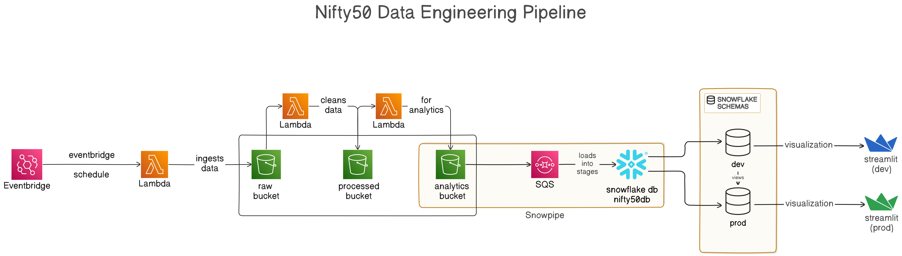

This project aims to showcase an end-to-end automated data engineering pipeline, starting from the ingestion of data to S3 buckets to the loading of the processed data into the Snowflake data warehouse. The end analytics are visualized and deployed using Streamlit.

## About NIFTY50

NIFTY50 (National Stock Exchange Fifty) is a giant scoreboard for India's stock market that tracks the performance of top 50 companies listed on the National Stock Exchange (NSE).

It gives us a sense of how the Indian stock market is doing overall, because it focuses on the biggest and most influential companies.

## Pipeline Components

This data pipeline uses AWS for computation and as a data lake storage and Snowflake as its data warehouse.

It uses:

### AWS Components

- **Lambda Functions**: a serverless compute for running short workloads. It is used for two purposes:
    - ingesting data into the s3 bucket
    - preprocessing the data

- **Eventbridge**: used as a scheduler which runs Lambda every 24 hours for ingesting the latest fetched data into s3 "raw" bucket.

- **S3**: used as a data lake for storing the ingested data.

- **SQS**: used as a notification queue that notifies snowflake pipe if new data arrives in the s3 "analytics" bucket.

### Snowflake Components

- **Database**: named "Nifty50DB" for storing the data for downstream analytical tasks.

- **Schemas**: for seperating "DEV" and "PROD" environments.

- **Snowpipe**: an automated ingestion pipe that recieves the notification from the SQS and ingests the data into different stages accordingly.

## How the pipeline works?

1) The Eventbridge schedule runs a lambda function every 24 hours and that function ingests data into the S3 "Raw" bucket.

2) The ingested file is moved and processed among the S3 layered architecture.

### S3 Layered Architecture

AWS recommends a layered architecture for S3 for data engineering workloads. Each data layer must have an individual S3 buckets. The same architecture has been followed here:

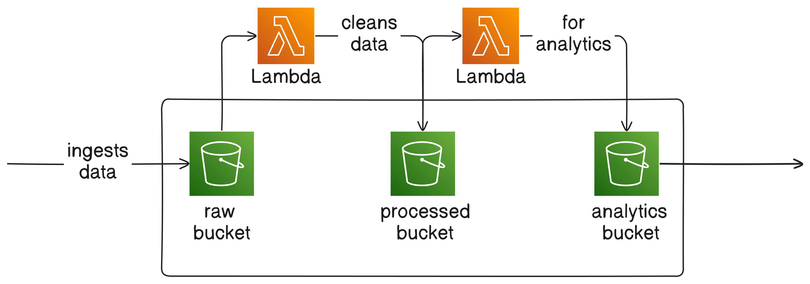

- **Raw Bucket**
    - It acts as a dump storage. The data is directly ingested here without any processing.
    - Whenever the ingested file matches a certain *suffix* pattern defined in the S3 events, the lambda is triggered processing only the required data.

    - 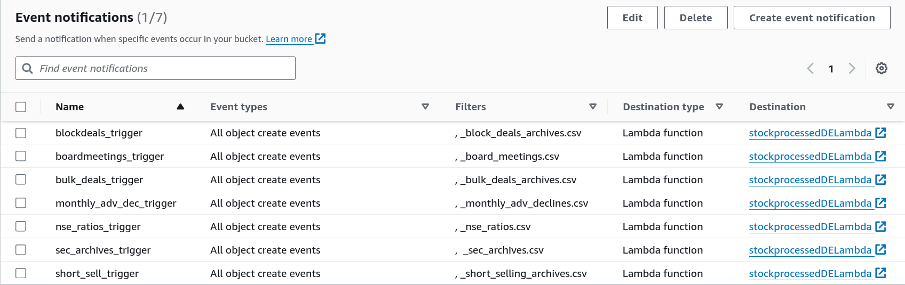

- **Processed Bucket**
    - This bucket receives the processed and cleaned data.
    - Here also, whenever the ingested file matches a certain *suffix* pattern defined in the S3 events, the lambda is triggered.

    - 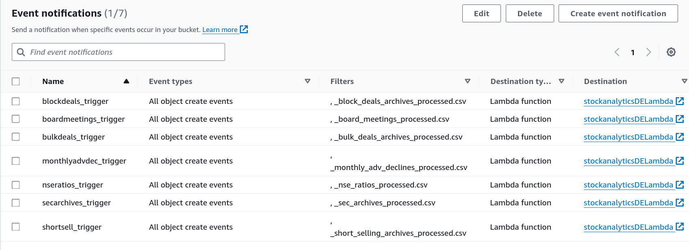

- **Analytics Bucket**
    - This bucket contains the data in the consumption-ready format.
    - This bucket has S3 events which send the notification to the **SQS** queue of Snowflake (AWS based) account whenever a pattern is matched.
    - 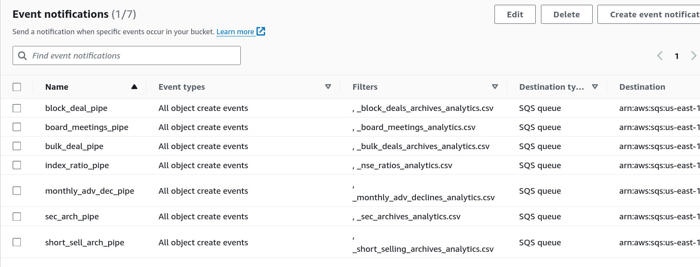

3) The Snowpipes created in Snowflake pick-up the notification from the SQS and then ingest the data into the staging area and eventually to the tables created in the **DEV** schema.

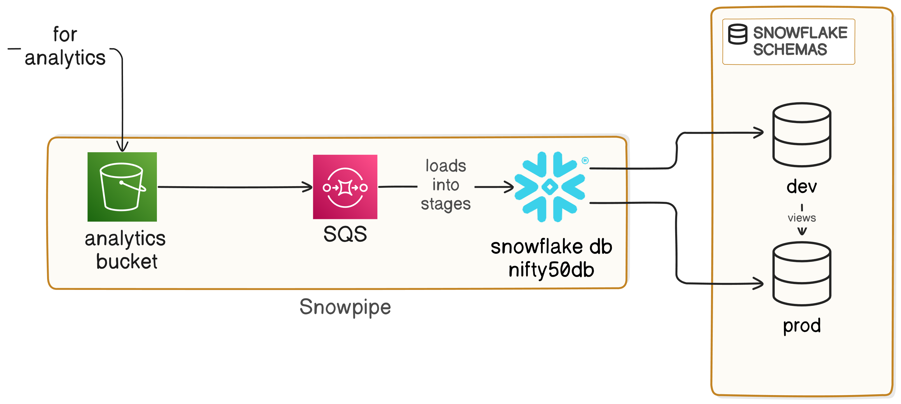

4) The **PROD** schema consists of various views on the **DEV** schema. This project uses *normal views* but *materialized views* can be used for increased efficiency and speed but as  *materialized views* are enterprise-only, *normal views* are implemented for keeping this project under free tier.

5) The analytics dashboard is built using **Streamlit**. There are two versions of dashboard for keeping the **dev** and **prod** environments different.

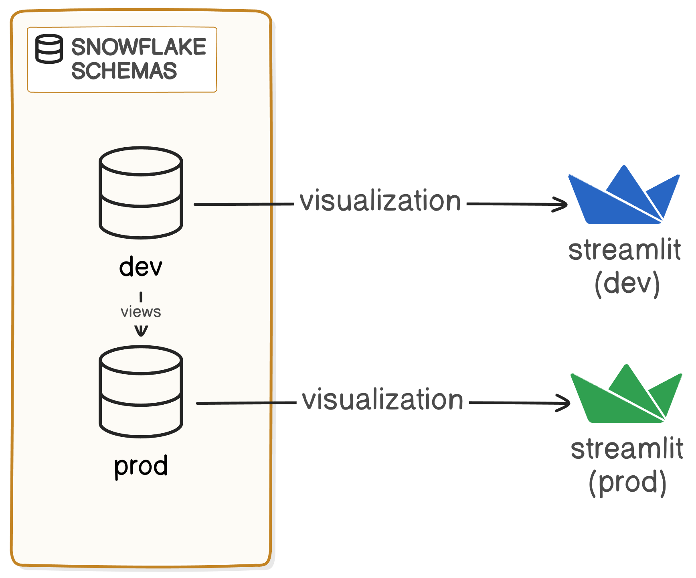

| | |
| -- | -- |
| 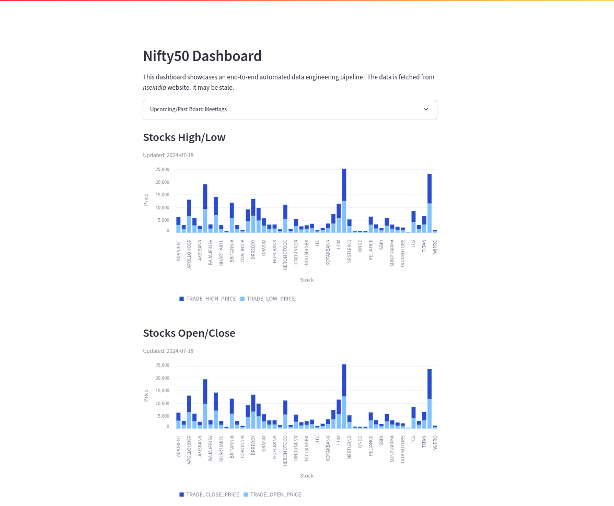 | 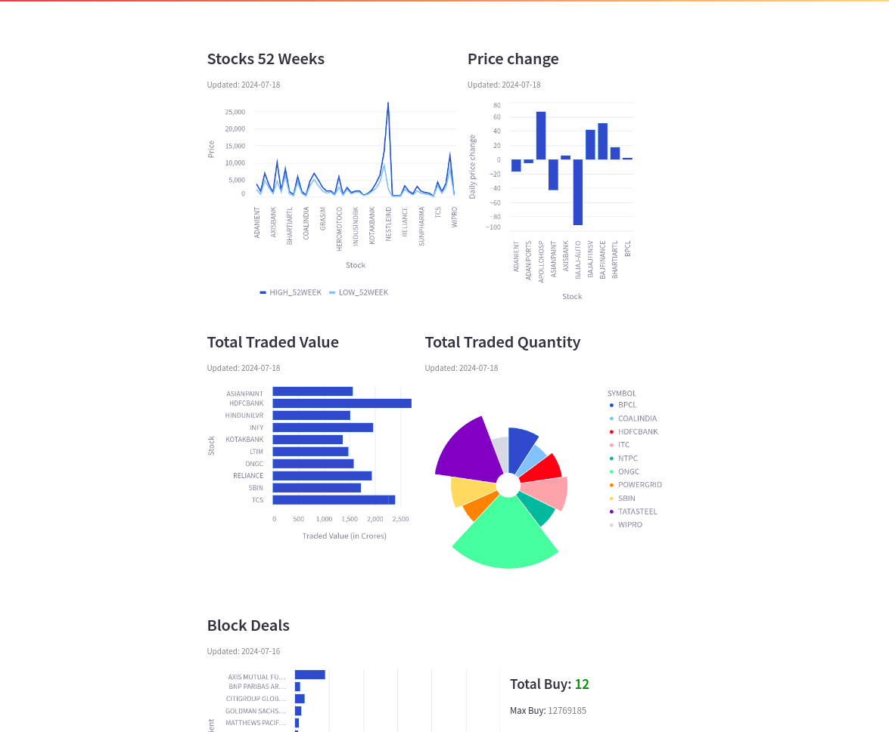 |
| 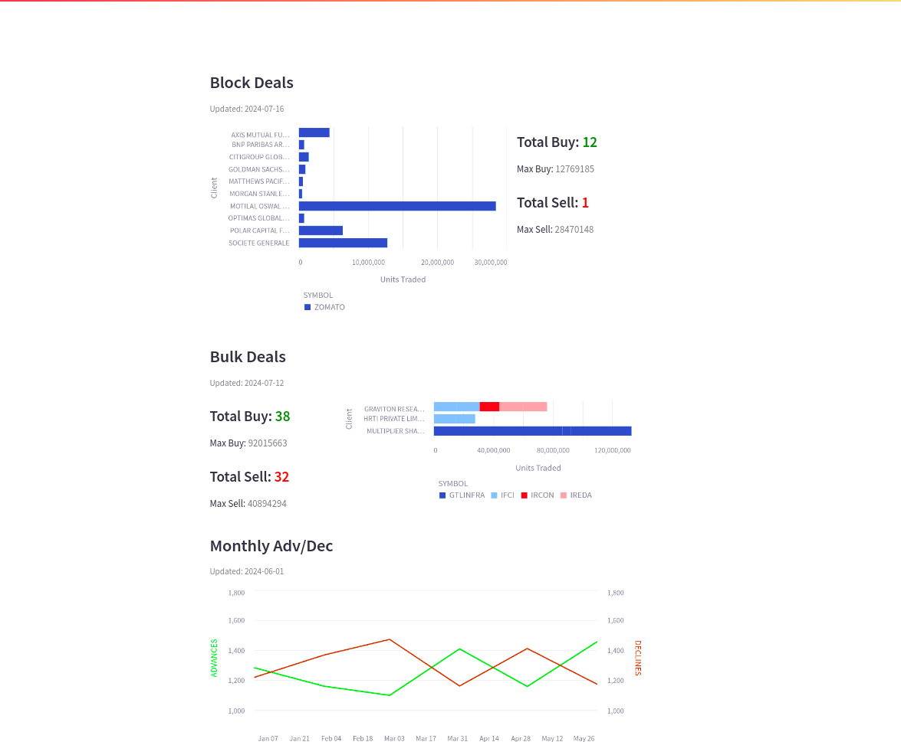 | 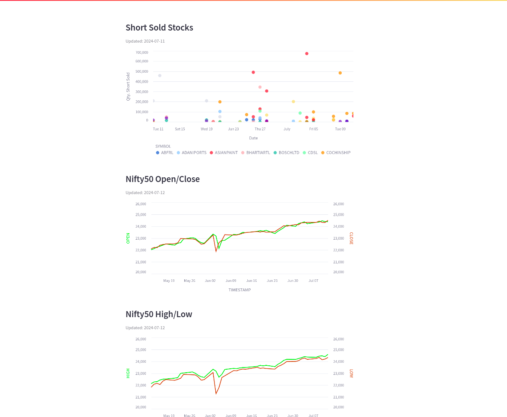 |

## Project Setup

To setup this project, follow the steps:

1) Make sure that the `tf/0_providers.tf` has the correct info about your AWS. Also, ensure that the AWS creds are there in your system env variables.

2) Run `terraform init` inside `tf` followed by `terraform apply`. It will setup the s3 buckets and the corresponding lambda functions and s3 event notifications.

3) Create the data warehouse on Snowflake using the `sql` files present under `sql/` dir.

4) Create a Role in AWS with access to the S3 bucket and replace the `Principal` and `sts:ExternalID` with the corresponding values from `DESC INTEGRATION aws_stage_data;` in Snowflake.

5) Make sure to replace the `STORAGE_AWS_ROLE_ARN` and `STORAGE_ALLOWED_LOCATIONS` in `2_stage_creation.sql`.

6) Note the Snowflake SQS pipe arn after running `SHOW PIPES;` in Snowflake and uncomment and replace the `queue_arn` in the terraform scripts under the S3 analytics bucket creation.

7) Test by uploading the files with the correct format and naming, as specified in the S3 event notifications, to the S3 "Raw" bucket. The SQS pipe will automatically load the file inside the warehouse.

8) To clean up the infrastructure, run `terraform destroy`.